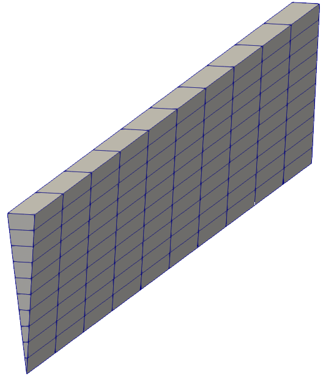

blockmeshbuilder
=============================
This module enables users to concisely define and efficiently manipulate 3D block structures, for the purposes of creating hexahedral block-structured meshes for CFD.


For example, the NACA 4424 airfoil mesh shown above comprises a boundary layer block structure 'wrapped' around the airfoil, and a far-field block structure. The [NACA airfoil code example](tests/airfoil.py) can be used directly to create a similar mesh for any NACA 4-digit airfoil, or easily modified to create a mesh for any other airfoil.

How does it work?
-----------------
The user writes a Python script using blockmeshbuilder to create a clear, descriptive representation of the desired block structure(s). After creation, elements of these block structures (i.e. vertices, edges, and faces) can be manipulated, projected to simple geometries, or mated to other block structures. At the end of the python script, the data are written to a blockMeshDict file with a single line of code. Then the user can run [OpenFOAM's `blockMesh` tool](https://cfd.direct/openfoam/user-guide/v8-blockMesh/) to generate the mesh.

Simple Example
-----------------
Below is the [wedge.py](tests/wedge.py) example which generates the wedge model described [here](https://openfoamwiki.net/index.php/Main_ContribExamples/AxiSymmetric).

```python
from math import radians
from blockmeshbuilder import BlockMeshDict, TubeBlockStruct, BoundaryTag

# Wedge dimensions
wedge_angle = radians(10.0)
wedge_radius = 0.19

# Co-ordinates of block vertices (r, theta, z)
rs = [0, wedge_radius]
ts = [-wedge_angle / 2, wedge_angle / 2]
zs = [0, 1]

# Number of cell divisions of the block in each direction
nr = 10
nt = 1
nz = 10

# Create the block structure
wedge = TubeBlockStruct(rs, ts, zs, nr, nt, nz, zone_tag='wedge')

# Tag front and back boundaries
wedge.boundary_tags[..., 0, 2] = BoundaryTag('front')
wedge.boundary_tags[..., -1, 2] = BoundaryTag('back')

# Initialize blockmeshbuilder to gather block structures.
block_mesh_dict = BlockMeshDict(metric='mm', of_dist='.org')

# Write the wedge to the block_mesh_dict object
wedge.write(block_mesh_dict)

# Output
block_mesh_dict.write_file('OF_case/system/')
```

After running the above code, which writes the blockMeshDict file into the system folder of an OpenFOAM case directory, run `blockMesh` to create the mesh. The mesh can be viewed using [Paraview](https://www.paraview.org/). 



How is this better than writing the blockMeshDict file myself?
--------------------------------------------------------------------
blockMeshDict files contain lists of geometries, blocks, faces, etc... which all reference a master list of vertices by index or by name. This is reasonable for simple geometries, but quickly becomes untennable for complex ones. Manually tracking chages to vertex references is tedious at best. I have even found it difficult to debug blockMeshDict files with two blocks.

There are many other issues related to the required duplication of commands. For example, when grading a block edge shared by two or more blocks, the same grading specifications must be provided to each block definition. In blockmeshbuilder, all these things are handled automatically. For example, in the same grading scenario, blockmeshbuilder requires the grading to be specified once, and will write the required grading definition to all blocks sharing the common edge.

Dependencies
-----------------
In order to run blockmeshbuilder you will need a working installation of 3.6+, along with the following modules:

 - [numpy](https://numpy.org/)

In addition, the airfoil example above relies on [shapely](https://pypi.org/project/Shapely/) to produce the outer boundary layer curve.

Installation
-----------------
Fork or clone this repository and execute `python -m pip install .` for the regular installation, or `python -m pip install -e .` for developer mode.

History
-----------------
This project was originally an outgrowth of [takaakiaoki/ofblockmeshdicthelper](https://github.com/takaakiaoki/ofblockmeshdicthelper) which still contains code similar to blockmeshbuilder/core.py. This project is substantially different, in that the focus is placed on precise manipulation of block structures, to ease the construction of meshes requiring many blocks.